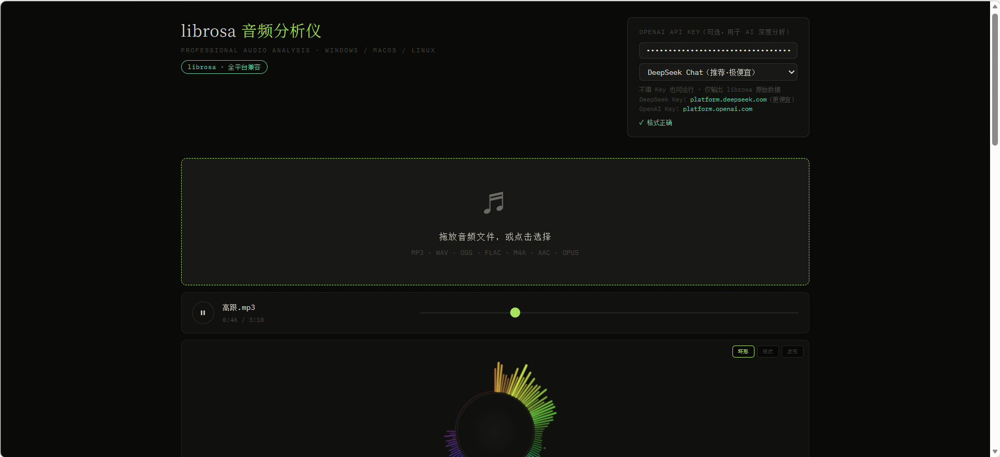
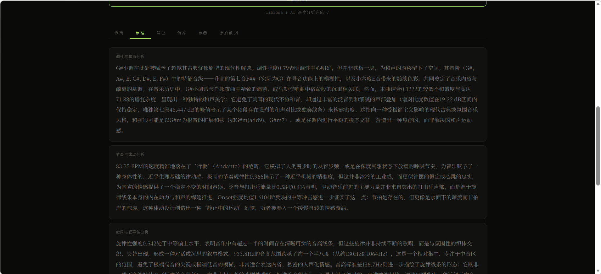

<p align="center">
  
</p>

<h1 align="center">SonicLens</h1>

<p align="center">
  <strong>Professional Audio Intelligence Platform</strong><br>
  <i>基于 librosa + LLM 的专业级音频分析与 AI 乐评系统</i>
</p>

<p align="center">
  <a href="#快速开始">快速开始</a> ·
  <a href="#核心能力">核心能力</a> ·
  <a href="#技术架构">技术架构</a> ·
  <a href="#api-文档">API 文档</a>
</p>

<p align="center">
  
  
  
  
</p>

---

## 产品预览

<table>
<tr>
<td width="50%"></td>
<td width="50%"></td>
</tr>
<tr>
<td align="center"><i>多维音频特征概览</i></td>
<td align="center"><i>AI 驱动的深度乐评分析</i></td>
</tr>
</table>

---

## 核心能力

### 专业级声学特征提取

基于 **librosa** 音频分析引擎，一次分析提取 **数百维**声学特征：

| 维度 | 特征 |
|------|------|
| **节奏** | BPM 检测、节拍追踪、节奏规律性、可舞性估算 |
| **调性** | Krumhansl-Schmuckler 调性识别、和弦推断、调式判断 |
| **音色** | MFCC 40 维系数、谱质心、谱滚降、谱平坦度、谱带宽 |
| **频谱** | 8 段精细频带能量、频谱对比度、频谱流量、不和谐度 |
| **动态** | RMS 响度、峰值/均值响度、动态范围（LU） |
| **旋律** | PYIN 基频提取、旋律轮廓、音高范围统计 |
| **结构** | 响度动态轮廓（10 段时序能量曲线） |

### AI 乐评深度分析

集成大语言模型（DeepSeek / OpenAI），以**专业乐评人**视角输出 7 大深度分析维度：

> *"从 A♭ 大调出发，调性强度 0.85 说明主音控制力极强，结合不和谐度 0.12 的低水平，推断其和声风格偏向晚期浪漫主义的丰满与温暖..."*

| 分析维度 | 说明 |
|----------|------|
| `structure_analysis` | 三幕式音乐结构拆解：引子 → 发展 → 高潮 → 消退 |
| `key_harmony_analysis` | 调式与和弦的色彩联想与情感映射 |
| `rhythm_groove_analysis` | 节奏律动与人体感受、Groove 分析 |
| `timbre_texture_analysis` | 音色织体、乐器层次与声场空间 |
| `dynamics_emotion_analysis` | 动态变化与情感张力的叙事弧线 |
| `melody_narrative_analysis` | 旋律线条的叙事性与记忆点 |
| `freq_landscape` | 频谱景观的诗意化描述 |

### 实时可视化引擎

基于 **Web Audio API + Canvas** 构建的高性能可视化，支持三种模式实时切换：

- **环形频谱** — 128 条辐射线 + 低频爆闪 + 粒子散射
- **柱状频谱** — 经典频域柱状图
- **波形模式** — 时域波形 + 镜像渲染

---

## 快速开始

### 环境要求

- Python 3.9+（安装时勾选 **Add to PATH**）
- Windows / macOS / Linux
- 现代浏览器（Chrome / Edge / Firefox）

### 一键启动（Windows）

```bash
# 解压项目后，双击即可
启动.bat
```

脚本会自动完成：检测 Python → 创建虚拟环境 → 安装依赖 → 启动服务 → 打开浏览器

### 手动安装

```bash
git clone <repo-url>
cd librosa_analyzer

python -m venv venv
source venv/bin/activate    # Windows: venv\Scripts\activate
pip install -r requirements.txt

python app.py
```

启动后访问 **http://localhost:8000**

---

## 使用指南

### 基础分析（无需 API Key）

1. 拖放音频文件到页面（MP3 / WAV / FLAC / OGG / M4A / AAC / OPUS）
2. 点击 **开始专业分析**
3. 查看完整的 librosa 特征数据

### AI 深度分析

在页面右上角填入 API Key（自动保存在浏览器中，只需填一次）：

| 提供商 | 获取地址 | 模型 | 单次成本 |
|--------|----------|------|----------|
| **DeepSeek** | [platform.deepseek.com](https://platform.deepseek.com/api_keys) | deepseek-flash | ~&yen;0.01 |
| OpenAI | [platform.openai.com](https://platform.openai.com/api-keys) | gpt-4o-mini | ~$0.02 |

---

## 技术架构

```
┌─────────────────────────────────────────────────┐
│                  Browser (SPA)                   │
│  Web Audio API · Canvas · localStorage           │
└──────────────────────┬──────────────────────────┘
                       │ REST API
┌──────────────────────▼──────────────────────────┐
│              FastAPI Backend                      │
│  ┌─────────────────┐  ┌────────────────────┐    │
│  │   librosa 0.10   │  │   OpenAI SDK       │    │
│  │  特征提取引擎     │  │  DeepSeek / GPT    │    │
│  │  数百维声学特征   │  │  乐评式深度分析     │    │
│  └─────────────────┘  └────────────────────┘    │
│           Uvicorn ASGI Server                    │
└─────────────────────────────────────────────────┘
```

### 技术栈

| 层级 | 技术 |
|------|------|
| 后端框架 | FastAPI + Uvicorn |
| 音频分析 | librosa 0.10.2, numpy, soundfile |
| AI 推理 | OpenAI SDK（兼容 DeepSeek / OpenAI） |
| 前端渲染 | 原生 HTML/CSS/JS，Canvas 2D |
| 实时音频 | Web Audio API, AnalyserNode |

### 项目结构

```
librosa_analyzer/
├── app.py                # 后端主程序（特征提取 + AI 分析 + API）
├── requirements.txt      # Python 依赖声明
├── 启动.bat              # Windows 一键启动脚本
├── run.bat               # 轻量启动脚本（已安装依赖时使用）
├── README.md             # 项目文档
├── 1.png                 # 概览截图
├── 2.png                 # 分析截图
└── static/
    └── index.html        # 前端单页应用
```

---

## API 文档

### `POST /api/analyze`

上传音频文件进行分析。

**参数：**

| 字段 | 类型 | 必填 | 说明 |
|------|------|------|------|
| `file` | File | Yes | 音频文件 |
| `api_key` | String | No | DeepSeek / OpenAI API Key |
| `model` | String | No | 模型名称，默认 `deepseek-flash` |

**响应示例：**

```json
{
  "success": true,
  "filename": "track.mp3",
  "features": {
    "bpm": 128.0,
    "key": "Am",
    "scale": "minor",
    "key_strength": 0.82,
    "mfcc_mean": [/* 40 values */],
    "dynamic_contour": [0.12, 0.15, 0.18, 0.25, 0.22, 0.30, 0.28, 0.20, 0.14, 0.08],
    "freq_bands_8": { "sub_bass": 0.18, "bass": 0.22, /* ... */ }
  },
  "analysis": {
    "structure_analysis": "曲子以极简的钢琴动机开场...",
    "key_harmony_analysis": "从 A 小调出发...",
    "rhythm_groove_analysis": "128 BPM 的节奏...",
    "timbre_texture_analysis": "音色层次丰富...",
    "dynamics_emotion_analysis": "动态范围达到 14.2 LU...",
    "melody_narrative_analysis": "旋律线条以上行...",
    "freq_landscape": "低频区域形成了..."
  }
}
```

### `GET /api/health`

服务健康检查。

```json
{ "status": "ok", "backend": "librosa", "librosa_version": "0.10.2" }
```

---

## 常见问题

<details>
<summary><b>服务器启动失败？</b></summary>

1. 确认 Python 3.9+ 已安装，命令行输入 `python --version` 检查
2. 确保安装时勾选了 "Add Python to PATH"
3. 端口 8000 被占用时，`启动.bat` 会自动尝试释放
</details>

<details>
<summary><b>AI 分析报错？</b></summary>

1. 确认 API Key 正确且账户有余额
2. DeepSeek 推荐使用 `deepseek-flash` 模型，成本极低
3. 检查网络连接（需能访问对应 API 服务）
</details>

<details>
<summary><b>支持哪些音频格式？</b></summary>

MP3、WAV、OGG、FLAC、M4A、AAC、OPUS，建议文件大小 &lt; 50MB
</details>

<details>
<summary><b>如何分享给朋友？</b></summary>

将整个项目文件夹打包成 zip 发送，对方解压后双击 `启动.bat` 即可，首次运行会自动安装依赖。
</details>

---

## 许可证

[MIT License](LICENSE)

---

<p align="center">
  <sub>Built with librosa · Powered by LLM</sub><br>
  <sub>SonicLens &mdash; Hear Beyond Sound</sub>
</p>
